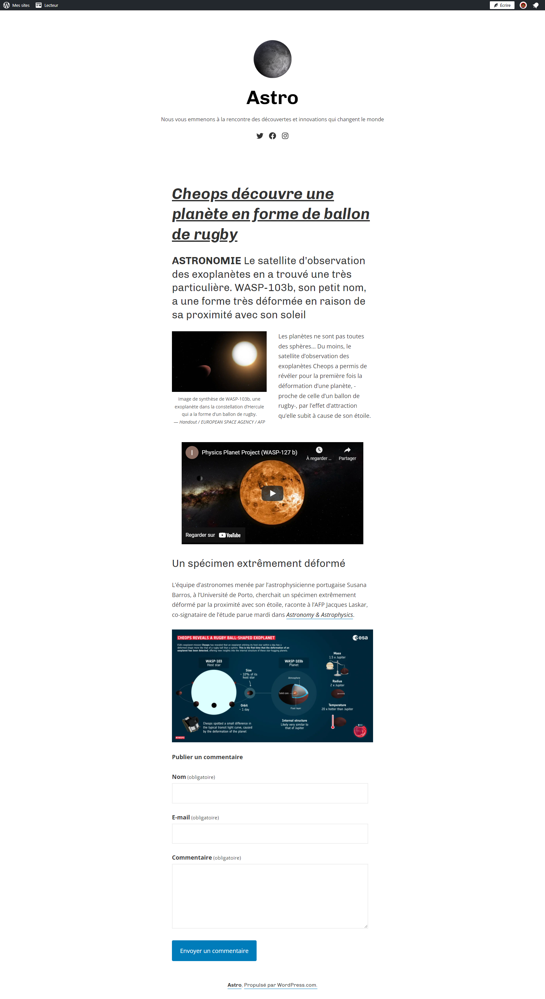
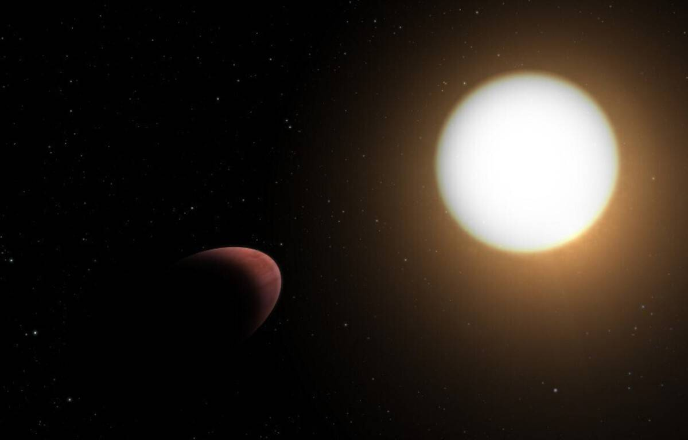
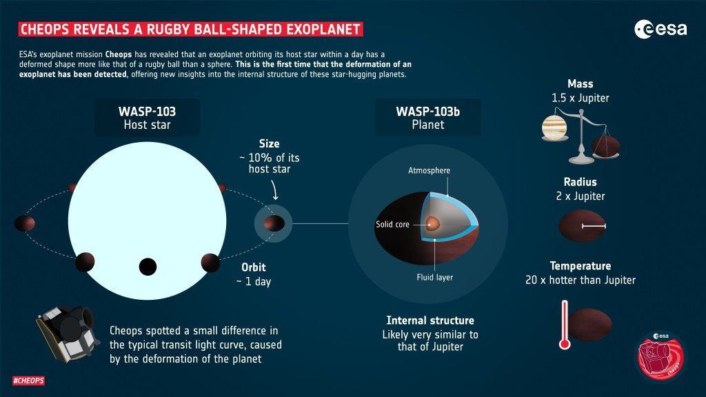

# Création d'une page classique avec l'éditeur guttenberg

Pour rappel Guttenberg est un éditeur de page qui repose sur l'utilisation de bloc. 

On ajoute des blocs, on y insère différents contenus:  
* Texte
* Image
* Vidéos
* ect.. 

Puis on les dispose dans la page.

## Démo en ligne
https://fr.wordpress.org/gutenberg/

## Pré-requis du TP
Gérer les réglages du site: 
* Icone
* Titre
* Description
* Langue: la plateforme doit être en français
* Fuseau horaire
* Visibilité du site
    * Confidentialité

## Objectif
L'objectif est de créer cette page en partant du thème Blank Canvas

https://wordpress.com/fr/theme/blank-canvas

### Blank Canvas 
C'est un thème WordPress gratuit. C'est un thème minimaliste, conçu pour les sites Web d'une seule page. Ses mises en page et ses publications uniques n'ont pas d'en-tête, de menus de navigation ou de widgets.

Les styles par défaut du thème sont conservateurs et reposent sur de simples polices sans empattement.

## Ressources
Les ressources sont disponibles

[Lien-1](images/exoplanet-wasp-103b.jpeg)

**Légende** : Image de synthèse de WASP-103b, une exoplanète dans la constellation d’Hercule qui a la forme d’un ballon de rugby. — Handout / EUROPEAN SPACE AGENCY / AFP

[Lien-2](images/esa-schema-rugby-ball-shaped-exoplanet.jpg)

## Critères d'acceptance
* Je dois pouvoir créer une page conforme à la maquette
* Je dois pouvoir personnaliser l'idendité du site avec un logo, un titre, une description
    * Titre: Astro
    * Description: Nous vous emmenons à la rencontre des découvertes et innovations qui changent le monde
* Je dois pouvoir créer un formulaire de commentaires
* Pour des raisons d'accessibilité et de référencement chaque image doit avoir un texte alternatif
