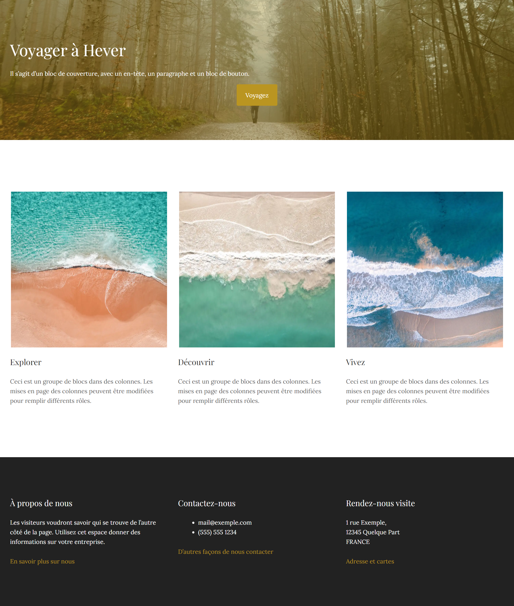

# Création d'une landing-page avec l'éditeur guttenberg

Pour rappel Guttenberg est un éditeur de page qui repose sur l'utilisation de bloc. 

On ajoute des blocs, on y insère différents contenus:  
* Texte
* Image
* Vidéos
* Groupes
* Baniere
* ect.. 

Puis on les dispose dans la page.

## Démo en ligne
https://fr.wordpress.org/gutenberg/

## Objectif
L'objectif est de créer cette landing page en partant du thème Blank Canvas

https://wordpress.com/fr/theme/blank-canvas

### Blank Canvas 
C'est un thème WordPress gratuit. C'est un thème minimaliste, conçu pour les sites Web d'une seule page. Ses mises en page et ses publications uniques n'ont pas d'en-tête, de menus de navigation ou de widgets.

Les styles par défaut du thème sont conservateurs et reposent sur de simples polices sans empattement.

## Ressources

### Texte: Lorem ipsum https://loremipsum.io/
Paragraphe des images: 

> Ceci est un groupe de blocs dans des colonnes. Les mises en page des colonnes peuvent être modifiées pour remplir différents rôles.

Paragraphe du pied de page:
Les visiteurs voudront savoir qui se trouve de l’autre côté de la page. Utilisez cet espace donner des informations sur votre entreprise

### Images: Importer via pexel
> Le format des images doit être de 450 largeur et 450 hauteur

## Block à utiliser
* Groupe
* Banière
* Espacement
* Colonne
* Bouton
* Titre
* Paragraphe
* Images

## Critères d'acceptance
* Je dois pouvoir visualiser la baniere avec un titre, un paragaphe et un bouton
* Je dois pouvoir visualiser les différentes thématiques dans une section.
    * Explorer
    * Découvrir
    * Vivez
* Je dois pouvoir visualiser un pied de page (footer)
    * A propos de nous
    * Contactez nous
    * Rendez nous visite
* Les différentes sections doivent être bien espacées
